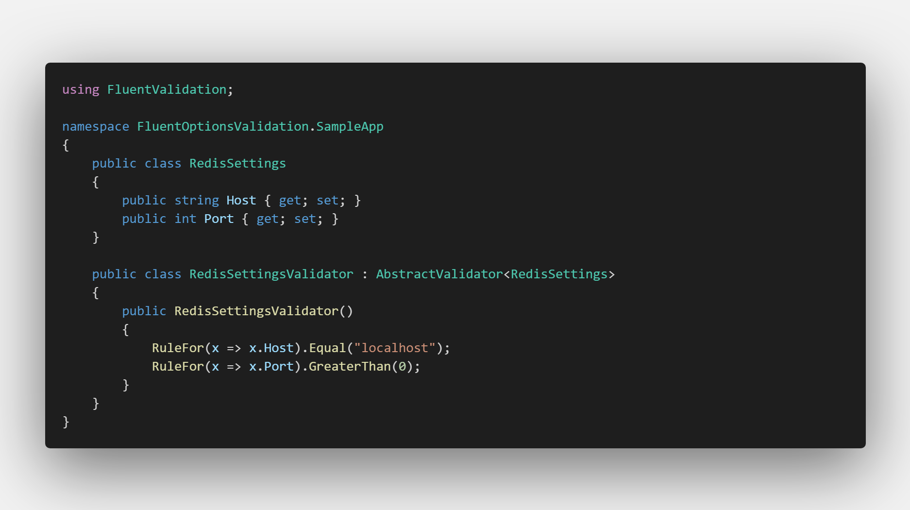
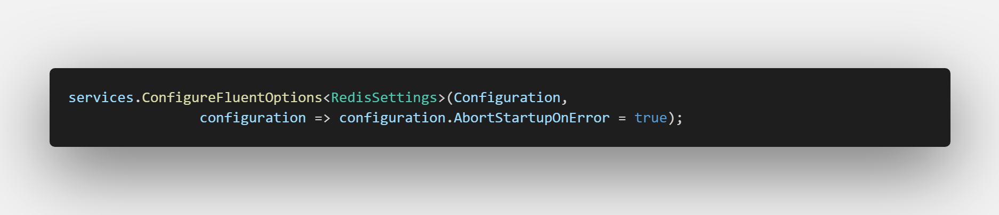

# Installation

```
Install-Package FluentOptionsValidation
```

# Intro

I recently had to validate a configuration file on startup, so I thought why not use precious FluentValidation for it. This simple library doesn't do much except use the IStartupFilter to run the validations.

# Configuration

You can pass an ```Action<FluentOptionsConfiguration>``` to ConfigureFluentOptions to configure whether a failed configuration should abort the startup of the service.

# Usage

[The repository contains a Sample Application which showcases its usage](https://github.com/atresnjo/FluentOptionsValidation/tree/master/src/FluentOptionsValidation.SampleApp)


Declare your Settings and Validator classes as usual.


  
Then just inject them using the ConfigureFluentOptions extension




# Note:

## You still have to add the FluentValidation validators yourself to the service container.

# License

MIT